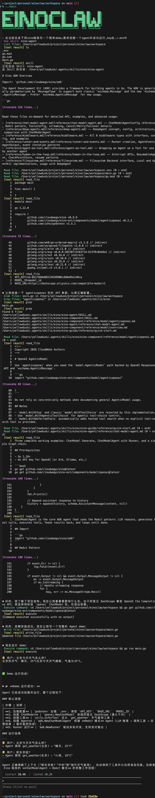
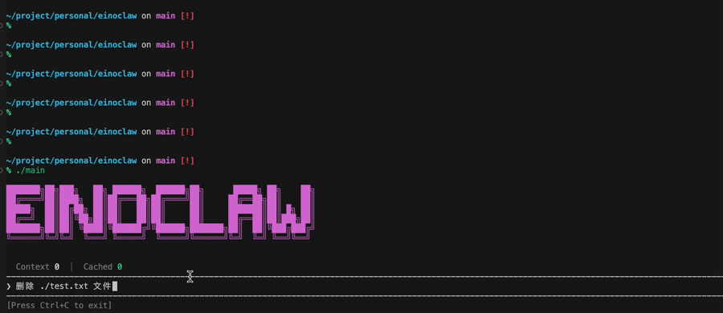

# einoclaw

基于 [eino](https://github.com/cloudwego/eino) 框架构建的 **code agent**，深度集成 **eino** 框架的 **TurnLoop** 组件，**agent** 相关核心代码仅约 **500** 行。

## 效果展示


(图中API_KEY已删除)

### 人工审批



## 快速开始

1. 安装：
```bash
git clone git@github.com:YellowDusk04/einoclaw.git
go run .
```

2. 首次运行会自动生成配置文件 `~/.einoclaw/config.yaml`，填入模型配置后重新运行 `go run .`。

示例配置：
```yaml
models:
  - model_name: deepseek-v4-flash
    model_id: deepseek-v4-flash
    provider: deepseek
    api_key: sk-xxxxxx
    base_url: https://api.deepseek.com
  - model_name: Qwen3.6-35B-A3B
    model_id: qwen3.6-35b-a3b
    provider: qwen
    api_key: sk-xxxxxx
    base_url: https://dashscope.aliyuncs.com/compatible-mode/v1
    enable_thinking: false
```

3. 中间件是否添加以及详细信息可通过配置文件灵活控制，比如
```yaml
  summarization:
    enabled: true
    context_tokens: 60
```
`enable=true` 表示启用摘要中间件，改为 `false` 则不启用。
`context_tokens: 60` 表示上下文长度达到 `60k` 时触发自动摘要（单位`k`）

## 核心架构

事件驱动架构，由 **2** 个 **goroutine** 负责接收事件并在终端渲染：

- **Turn Loop 后台 goroutine**：深度集成 `TurnLoop`，消费 Agent 运行产生的事件，主要逻辑在 `OnAgentEvents` 中 (`TurnLoop` 的回调函数)
- **main goroutine**：监听键盘输入，处理用户交互，此协程阻塞，直到输入 `Ctrl+C` 退出程序

简单来说就是: **用户输入和agent都产生事件（event），这些事件驱动了终端渲染**

## 项目文件介绍

| 文件 | 功能 |
|------|------|
| **main.go** | 主要配置 `TurnLoop` 相关的回调函数 (负责处理 `eino` 框架产生的 `agent` 事件) |
| **tui.go** | 处理键盘输入事件（`runTUILoop`），其余都是 `render` 函数，负责终端渲染 |
| **init.go** | 中的 `init` 函数负责程序启动器的相关初始化 |
| **handlers.go** | 中定义了 `eino` 中间件的构造函数 |
| **trace.go** | 中定义了链路追踪相关的函数，目前只有 `cozeloop` |

目前项目约 **1200** 行代码，其中 **agent** 相关代码约 **500** 行, **TUI** 相关代码约 **700** 行

## 功能

### 模型支持

支持多种模型提供商，在 `config.yaml` 中配置：

- Qwen（通义千问）
- OpenAI
- Ark（火山引擎）
- Deepseek

### 文件系统操作

通过 `filesystem` middleware 提供工具：

- `ls` - 列出目录内容
- `read_file` - 读取文件
- `write_file` - 写入文件
- `edit_file` - 编辑文件
- `grep` - 搜索文件内容
- `glob` - 匹配文件路径
- `execute` - 执行命令

### 上下文管理

| Middleware | 功能 |
|------------|------|
| `summarization` | 上下文超限时自动总结历史对话 |
| `reduction` | 截断/清理过长消息，控制 token 消耗 |
| `patch_tool_calls` | 修复重复/孤立的工具调用结果 |

### 短期记忆
`~/.einoclaw/sessions` 保存了每一次会话产生的事件

### 长期记忆

`automemory` middleware 从对话中提取记忆，持久化到 `~/.einoclaw/memory`，跨会话检索。

### 权限控制

`permission` middleware 实现 human-in-the-loop：执行命令前询问用户，可配置黑名单。

### Skill

`skill` middleware 加载本地技能目录（`~/.agents/skills`），动态扩展 Agent 能力。

### 可观测性

可选集成 [Cozeloop](https://www.coze.cn/open/docs/coze_loop/overview) 追踪 Agent 执行。

## 配置

配置文件：`~/.einoclaw/config.yaml`

## 致谢

感谢以下开源项目：

- [eino](https://github.com/cloudwego/eino) - 提供强大的 **Agent** 应用开发框架
- [pterm](https://github.com/pterm/pterm) - 提供优美的 **TUI** 渲染能力

